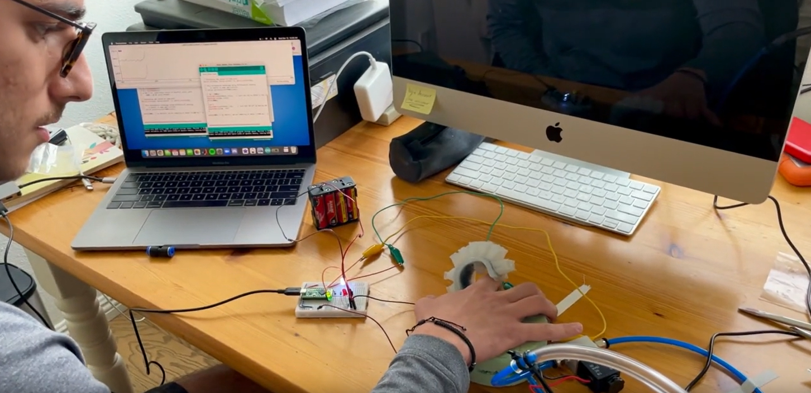
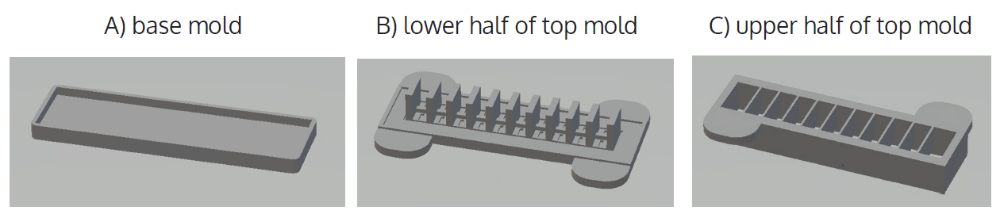
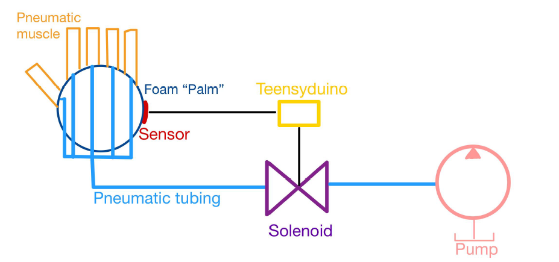
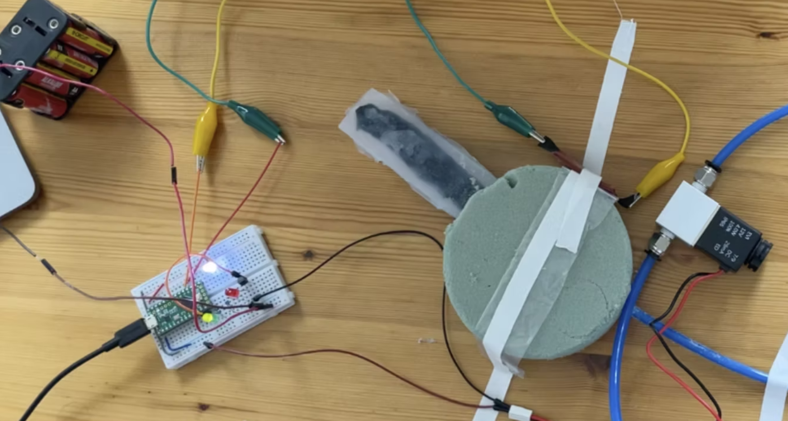
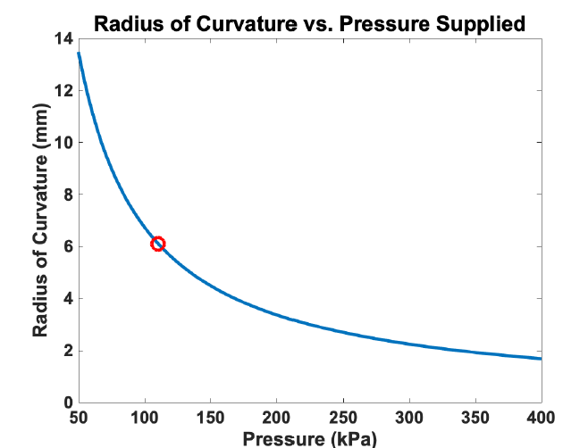

# Hand Shaking Soft Robot

This project demonstrates the design, modeling, fabrication, and testing of a **soft robotic finger** that senses a human hand and responds by inflating to "shake" the hand. Built as part of *ME 125EH* at UCSB, this work explores core principles of soft robotics — combining **pneu-net soft actuators** with **capacitive sensors** for safe and human-friendly interaction.

Click below to see the soft finger in action. Due to fabrication challenges, only one functioning finger was demonstrated.

  
*Demonstration video of the hand shaking soft robot.*

---

## Motivation

This project ties together soft actuation and soft sensing to showcase a proof-of-concept for future human-interactive robots and prosthetics. It draws from recent research on soft pneumatic muscles and soft capacitive sensors, adapted and prototyped within the constraints of a student project.

---

## Fabrication

The soft finger was fabricated using a custom three-part 3D-printed mold set:

  
*A) Base mold; B) Lower half of top mold; C) Upper half of top mold*

Each mold was filled with Dragon Skin™ 10 silicone rubber. A strain-limiting fabric layer was embedded in the base mold. Pneumatic tubing was inserted to supply pressurized air, sealed by the elasticity of the cured silicone.

---

## System Design

A soft capacitive sensor, fabricated using conductive fabric and rubber strips, detects when a hand is near. The sensor signal is read by a Teensyduino microcontroller, which controls a solenoid valve that routes compressed air into the pneu-net actuator.

  
*Block diagram of the hand shaking soft robot system.*

---

## Proof of Concept

Below shows the prototype system in operation on a workbench. The breadboard contains the Teensyduino and interface electronics; the foam palm holds the soft actuator and sensor.

  
*Prototype setup demonstrating sensor-actuator integration.*

---

## Modeling and Results

A beam bending model predicts the finger’s radius of curvature as a function of supplied air pressure. This helps confirm that increased pressure results in tighter bending.

  
*Predicted radius of curvature vs. air pressure supplied.*

Experimental measurements showed good agreement with the model, validating the design approach despite minor fabrication imperfections.

---

## Acknowledgements

Special thanks to Professor Elliot Hawkes, Brian Dincau, the Hawkes Lab, Matthew Devlin, and Trevor Marks for their guidance and support.
